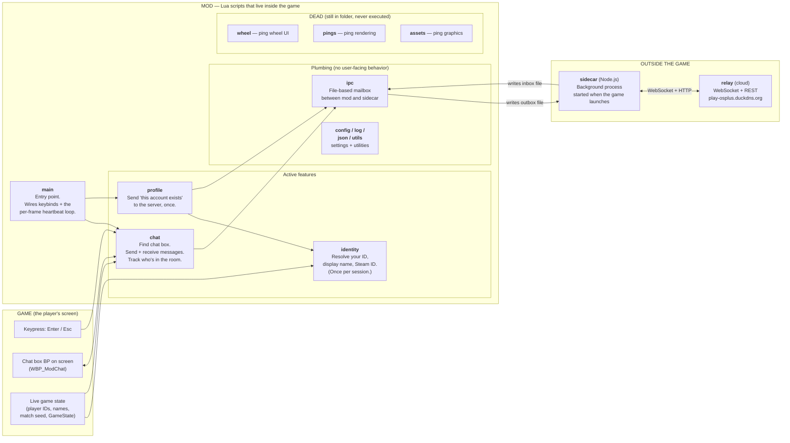

# OSPlus Lua script architecture

The canonical answer to *"what does each Lua script do, how do they
talk to each other, and where does behavior X live?"*

Companion to:
- [`domain-boundaries.md`](./domain-boundaries.md) - the **product/domain
  boundary** (what reusable concept owns a file, module, or data contract).
- [`state-contract.md`](./state-contract.md) — the **Lua/BP boundary**
  (what state lives in Lua vs in cooked Blueprint, and how they talk).
- [`.cursor/rules/mod-architecture.mdc`](../../.cursor/rules/mod-architecture.mdc)
  — the always-applied **enforcement rule** for both this doc and
  `state-contract.md`.

This doc is the *what is* (the map). The rule is the *what must be* (the
discipline). When they disagree, the rule wins and this doc is stale —
file a fix.

---

## The map

## What each script does

### Active

| Script | Role | One-line summary |
|---|---|---|
| `main.lua` | Entry point | Loads dependencies, wires cross-feature callbacks, calls each feature's `init()`, launches the sidecar, runs the per-frame tick loop, and owns the engine-global lifecycle multiplexer (map-load fan-out). |
| `chat.lua` | Feature: in-match chat | Finds the on-screen chat widget, owns Enter/Esc keybinds and the `OnRep_MatchState` hook (registered in its own `M.init()`), formats messages, derives the room code from the match seed, tracks presence. |
| `identity.lua` | Feature: identity resolution | Resolves the local player's Prometheus ID (one-shot via `RegisterHook` on `GetIdentityState`), display name (`PMPlayerUIData.Profile.Username`), and Steam ID. Caches everything; subsequent calls are pure cache reads. |
| `profile.lua` | Feature: account upsert | Subscribes to `identity.onPrometheusIdResolved`, waits for the friendly display name to land, emits one `profile_upsert` IPC message to the sidecar. Then `M.tick` short-circuits forever — see Per-tick discipline below. |

### Plumbing

| Script | Role | One-line summary |
|---|---|---|
| `ipc.lua` | Feature plumbing | The file-based mailbox between Lua and the sidecar. `outbox.jsonl` (Lua → sidecar), `inbox.jsonl` (sidecar → Lua), `heartbeat.txt` (Lua's "I'm alive" beacon, touched every 5 s). The mod cannot open sockets — UE4SS Lua has no networking — so the sidecar is the only path to anything outside the game. |
| `config.lua` | Settings | Constants: keybinds, file paths, color palette, the **version banner** that prints to console + log. |
| `log.lua` | Helpers | `log.log(msg)` writes to both UE console and a timestamped file (`%LOCALAPPDATA%/OSPlus/test_events.log`). `log.try(name, fn)` wraps a call in `pcall` and logs failures. |
| `json.lua` | Helpers | Third-party JSON encoder/decoder (rxi/json.lua). Flat structures only — no nested objects. |
| `utils.lua` | Helpers | Small utility functions used by chat (string trim, etc.). |

### Dead but still in the folder

| Script | Why it's still here |
|---|---|
| `wheel.lua` | Ping-wheel UI from an earlier abandoned ping-system attempt. Wired-up sites in `main.lua` are commented out (`-- DISABLED: ping wheel keybind`). |
| `pings.lua` | Render side of the same abandoned attempt. |
| `assets.lua` | The asset-loading helpers for ping VFX/SFX. |

These three add ~1,200 lines to the codebase that the runtime never
executes. They're kept around because reviving the ping system is on
the roadmap. If you read them and get confused about how a feature
works, it's because they're not part of any current feature — search
`mods.txt` and `main.lua`'s `require` block for the actual loaded set
before chasing anything in these three.

---

## The two principles

### 1. Features own their engine integration

Every UE registration that exists in service of a feature lives in
that feature's module, registered from a single `M.init()` exposed by
the module. `main.lua` calls `M.init()` once and never thinks about
that feature's engine wiring again.

**Today's enforcement:**
- `chat.init()` registers Enter/Esc keybinds + `RegisterHook` on
  `OnRep_MatchState`.
- `profile.init()` subscribes to `identity.onPrometheusIdResolved`.
- `identity` registers its `RegisterHook` on `GetIdentityState` at
  module load (a slightly different shape because it has no `init()` —
  the registration must happen at `require` time to win the cold-start
  race against the engine's identity bootstrap).

**The one allowed exception in `main.lua`:** the engine-global lifecycle
multiplexer. `RegisterLoadMapPostHook` lives in `main.lua` because its
body legitimately crosses features (chat resets, IPC truncates the
inbox, future features will hook their own onMapLoaded). Each feature
exposes an `M.onMapLoaded()` and the multiplexer fans out by calling
each one in order.

### 2. Per-tick discipline

`LoopAsync(30, ...)` runs every callee at ~30 Hz. Anything you do
per-tick is ~30,000 invocations per 17 minutes. **Every UE-reflected
call (`FindFirstOf`, `FindAllOf`, `:UFunctionCall(...)`, userdata
property read) allocates a UE4SS-tracked userdata wrapper.** UE4SS's
internal tracking table is not infinitely robust to that churn — we
crashed it doing exactly this from `profile.tick` (see
[`profile-tick-userdata-allocation-leak`](../learnings/profile-tick-userdata-allocation-leak.md)).

Three buckets, three patterns:

- **Session-immutable result** (PID, display name, Steam ID): cache
  once, short-circuit on cached value, zero UE calls thereafter.
- **Slow-changing state** (in-match flag, current widget): self-throttle
  to ~1 Hz with a tick counter; cache and only re-resolve on cache
  invalidation.
- **Genuinely per-frame** (typing poll, IPC inbox read): cheap operations
  only — Lua compares, small file reads, cached-userdata property reads.
  **No new UFunction calls that allocate.**

If a per-tick callee doesn't fit one of these three patterns, it
shouldn't be on the tick loop.

---

## Where to make changes (decision crib sheet)

| You want to... | Where it goes |
|---|---|
| Add a new keybind | The owning feature's `M.init()`. |
| Add a new UFunction hook | The owning feature's `M.init()`, with `pcall` + log on success/failure. |
| Add a new per-tick callee | The owning feature's `M.tick()`, gated by the right bucket from "Per-tick discipline." Then add the call to `main.lua`'s `LoopAsync` body. |
| Add a new outgoing IPC message | A `writeXxxToOutbox` function in `ipc.lua`, called by the feature module. |
| Add a new incoming IPC message | A handler in `ipc.lua`'s `poll` function, plus an `M.onXxxReceived` callback the feature module sets on `ipc`. |
| Add a new feature | New `<feature>.lua` module with `M.init()`, `M.tick()` (if per-tick work), and any `M.onMapLoaded()` / `M.reset()` lifecycle hooks. Wire it from `main.lua`: `require`, `init()`, add `tick` to `LoopAsync`, add lifecycle calls to the map-load multiplexer. |
| Change the chat widget contract | Coordinate Lua + BP per [`state-contract.md`](./state-contract.md). |
| Add a setting / constant | `config.lua`. |

---

## When this doc lies

This doc only lives if it's updated *with* the code. If you find
something here that doesn't match the code:

1. The code is the truth — open an issue or fix this doc in the same
   PR as the code change that broke it.
2. If the code is wrong (someone violated the rule), pull it back into
   shape rather than updating the doc to describe the violation.

Both `state-contract.md` and this doc are referenced from
[`mod-architecture.mdc`](../../.cursor/rules/mod-architecture.mdc), the
always-applied rule for `mod/**/*.lua` work. That rule is the agent's
backstop. This doc is the human's map.
