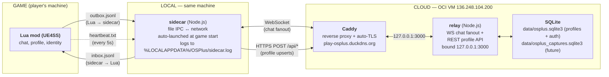

# OSPlus relay + sidecar architecture

The canonical answer to *"how does OSPlus get data out of the
game and into the cloud (and back), and where does the
boundary between Lua / sidecar / relay sit?"*

Companion to:

- [`mod-scripts.md`](./mod-scripts.md) — the **Lua side** of
  the boundary (which scripts talk to IPC, who triggers what).
- [`state-contract.md`](./state-contract.md) — the **Lua / BP
  boundary** (UE-side state ownership; not relevant past the
  IPC files).
- [`docs/ops/deploy-relay.md`](../ops/deploy-relay.md) — the
  **operational runbook** for the OCI VM hosting the relay
  (provisioning, deploying, troubleshooting).
- [ADR 0002](../decisions/0002-profile-storage.md) — the
  **decision record** for why the profile + capture
  persistence layer ended up in the relay process.

This doc is the *what is* (the architecture map). The runbook
is the *what to do* (the operational procedures). The ADR is
the *why we picked this shape* (alternatives considered + why
this won).

> **Status:** authored 2026-05-01 by absorbing and modernizing
> the contents of the prototype-era "Network Relay Architecture"
> section that previously lived in
> [`KNOWLEDGEBASE.md`](../../KNOWLEDGEBASE.md). The KB section
> was a snapshot of the **ping-prototype** era (room-only pings,
> file-based IPC, no persistence) and was stale — the live
> system today carries chat (not pings) and includes an HTTP
> REST API for per-install profiles. This doc replaces the KB
> section.

## The map



## The four-process chain

The end-to-end path from game to cloud is **four processes,
two protocols, three hosts**:

| Process | Where it runs | What it owns |
|---|---|---|
| **Lua mod** | Inside `OmegaStrikers.exe` (UE4SS-injected) | Game-side feature logic. Cannot open sockets — UE4SS Lua has no networking. |
| **Sidecar** | Same machine as the game (`%LOCALAPPDATA%\OSPlus\sidecar.exe`) | The bridge. File IPC on the local side, WebSocket + HTTPS on the network side. Auto-launched by the mod (via UE4SS `os.execute`) at game start. On Linux/Steam Deck, the game runs under Proton; OSPlus launches the same Windows sidecar directly inside that compatibility layer so `%LOCALAPPDATA%` stays shared with Lua. |
| **Caddy** | OCI VM `136.248.104.200` | Reverse proxy. Owns TLS termination for `play-osplus.duckdns.org`. Routes everything to `127.0.0.1:3000`. |
| **Relay (Node.js)** | OCI VM, behind Caddy, listening on `127.0.0.1:3000` | The fanout + persistence layer. Two responsibilities under one process per [ADR 0002](../decisions/0002-profile-storage.md): WS chat broadcast + REST profile API. |

**Why the sidecar exists at all.** UE4SS's Lua runtime has no
sockets, no native HTTP, no async I/O beyond file system access.
The sidecar is the "anything that needs the network" process —
without it, the mod can render UI and read engine state but
can't talk to anything.

## File IPC contract — Lua ↔ sidecar

All cross-process state lives in `%LOCALAPPDATA%\OSPlus\` as
flat JSONL files plus a single heartbeat file.

| File | Writer | Reader | Purpose |
|---|---|---|---|
| `outbox.jsonl` | Lua mod | Sidecar | Outgoing messages (chat sends, room joins/leaves, profile upserts). One JSON object per line. Sidecar tracks read offset. |
| `inbox.jsonl` | Sidecar | Lua mod | Incoming messages (chat from other players, room presence updates, errors). One JSON object per line. Lua polls every ~90 ms (3 ticks at 30 ms). |
| `heartbeat.txt` | Lua mod | Sidecar | Lua's "I'm alive" beacon. Touched every 5 s. Sidecar **exits** if no heartbeat for 20 s (with a 30 s startup grace) — this is how the sidecar knows the game closed. |
| `sidecar.log` | Sidecar | (operator) | Sidecar's persistent log. On Windows the sidecar usually runs hidden via the wscript.exe shim; on Proton it is launched directly. Either way stdout is unreliable for users, so we mirror everything to this file. Truncated at each start. |

**Format.** All IPC messages are flat JSON objects with a
`type` field. No nesting (the Lua-side JSON encoder is
deliberately flat-only). Examples:

```json
{"type":"chat","text":"gg","audience":"team","targetTeam":0,"ts":1712345678}
{"type":"room_change","room":"AAX45ABA","username":"Ispicas","team":0}
{"type":"profile_upsert","prometheus_id":"6333a58673a37dc7cb11a7a7","display_name":"Ispicas"}
```

**Why files, not a local socket.** File IPC adds ~30–50 ms
overhead per round trip (acceptable for chat; not for anything
latency-critical). The win is that **the IPC is fully
inspectable + survives sidecar restarts** — a developer can
`tail` the inbox/outbox to see exactly what's flowing, and the
sidecar can exit cleanly without the mod losing queued
messages on its side. This is also the substrate the abandoned
ping prototype used; OSPlus paid the implementation cost once
and chat reused it.

**Heartbeat-driven shutdown.** The sidecar's lifetime is
*coupled to the game process via the heartbeat file*, not via
an OS-level parent-process tracking mechanism (which doesn't
exist cleanly on Windows for the wscript.exe-launched shim).
Lua writes a timestamp to `heartbeat.txt` every 5 s; if the
sidecar polls and sees the file is >20 s stale, it self-exits.
This is the canonical "the game closed" signal.

## Wire-protocol shape — sidecar ↔ relay

Two distinct transports for two distinct responsibilities.
**Both are deliberately separate** per [ADR 0002 → "T-β over
T-α / T-γ"](../decisions/0002-profile-storage.md#why-these-picks-one-paragraph-each)
— multiplexing profile traffic over the chat WebSocket would
pay a correlation-ID tax for no gain.

### WebSocket — chat / ping fanout

`wss://play-osplus.duckdns.org/` (Caddy reverse-proxies to
`ws://127.0.0.1:3000/`).

- **Connection model.** Sidecar opens one WS to the relay,
  joins exactly one match-wide room at a time, broadcasts and receives
  inside that room. **Rooms are ephemeral** — they vanish on
  process restart by design. Chat messages carry an `audience`
  field (`all` or `team`); the relay filters team-targeted
  messages using the message's `targetTeam` and each joiner's
  `team` value.
- **Room codes** come from the Lua side (per
  [`docs/learnings/relay-room-code-regex-vs-derived-codes.md`](../learnings/relay-room-code-regex-vs-derived-codes.md))
  — chat derives a room code from
  `GameState_Game_C.CurrentMatchSeed` so all OSPlus users in
  the same online match end up in the same chat room without
  needing share-codes. Team-only vs all-player delivery is a
  message-level audience, not a separate room.
- **Validated message types.** `join`, `leave`, `chat`, `ping`
  (`presence` is server-out-only and can't be sent by clients).
  Anything else is dropped at the relay's input validator.
  `join` may carry `team` (`0` or `1`); `chat` may carry
  `audience:"all"` or `audience:"team"` plus `targetTeam`.
  Lua maps the game's raw `EAssignedTeam` values (`TeamOne=1`,
  `TeamTwo=2`) into relay routing indices (`0`, `1`) before
  writing IPC.
- **Hardening baseline** (relay-side):
  - 4 KB max payload (ws-level cap).
  - 5 connections per source IP.
  - 5 messages/sec per connection (drop on violation).
  - Strict shape validation on `type`, `room`, etc.
  - Optional shared-secret token via `RELAY_TOKEN` env var.
- **Keep-alive: protocol-level WS pings every 15 s, drop after
  10 s pong timeout.** Distinct from the file-based game
  heartbeat above — this one defends against zombie
  Caddy-held sockets after relay restart, per
  [`docs/learnings/sidecar-ws-keepalive.md`](../learnings/sidecar-ws-keepalive.md).

### HTTPS REST — profile + future captures

`https://play-osplus.duckdns.org/api/*` (Caddy reverse-proxies
to `http://127.0.0.1:3000/api/*`).

Per [ADR 0002 → A-2](../decisions/0002-profile-storage.md#decision):

- **Per-install bearer tokens.** Sidecar generates a random
  token at first run, stores it in `%LOCALAPPDATA%\OSPlus\token`
  with restrictive ACLs.
- **TOFU binding.** First call to `POST /api/auth/pair`
  binds the token to the player's Prometheus ID. Subsequent
  requests carry the token; mismatch returns `401`. Cross-PID
  access returns `403`.
- **Profile upserts** flow as `profile_upsert` IPC messages
  from Lua → sidecar → REST POST. Sidecar deduplicates and
  caches the bearer token.
- **Captures** (future feature, not yet shipped) will use the
  same auth surface and a separate `data/osplus_captures.sqlite3`
  per [ADR 0002 → R-Y](../decisions/0002-profile-storage.md#decision).

## The relay process — single Node, two responsibilities

Lives at `server/index.js`. Two responsibilities under one
process per [ADR 0002 → S-A](../decisions/0002-profile-storage.md#decision):

1. **WebSocket chat fanout** — room-scoped, ephemeral, no
   persistence. Implementation in `server/index.js` directly.
2. **REST API** — profile rows + auth tokens, persisted to
   SQLite. Implementation in `server/api/` (the `createApi()`
   factory mounted at `/api/*`).

**Module boundary discipline.** `server/index.js` only ever
calls `api.handleHttp(req, res)` — the SQLite `Database()`
instance is owned exclusively by `server/api/`. This keeps the
extraction-to-separate-process path mechanical if scale ever
forces it (per ADR 0002's escape hatch).

**Storage layout** (per [ADR 0002 → R-Y](../decisions/0002-profile-storage.md#decision)):

| File | Owner | Contents |
|---|---|---|
| `data/osplus.sqlite3` | `server/api/` | `profiles` (Prometheus ID PK, display name, cosmetic loadout, mastery), `auth_tokens` (TOFU-bound bearer tokens, hashed) |
| `data/osplus_captures.sqlite3` | `server/api/` (future) | `match_captures` + `redirect_events` for the eventual capture feature. Separate file = independent write lock + independent backup cadence. |

**Process boundaries on the VM.**

- The relay binds `127.0.0.1:3000` (not public). Caddy is the
  only TLS-terminating front door.
- Runs as the unprivileged `osplus` user.
- systemd unit at `server/deploy/osplus-relay.service`.
- **Does NOT use `MemoryDenyWriteExecute=true`** — V8's JIT
  needs writable+executable pages. See
  [`docs/learnings/oci-relay-deploy-gotchas.md`](../learnings/oci-relay-deploy-gotchas.md)
  before re-attempting hardening.

## Where to make changes — decision crib sheet

| You want to... | Where it goes | Notes |
|---|---|---|
| Add a new IPC message (Lua → sidecar) | `mod/OSPlus/scripts/ipc.lua` (writer) + `sidecar/index.js` switch on `msg.type` (handler) | Keep the message shape flat (no nested objects). |
| Add a new IPC message (sidecar → Lua) | `sidecar/index.js` (writer) + `mod/OSPlus/scripts/ipc.lua` poll handler + `M.onXxxReceived` callback the feature module sets on `ipc` | Match the Lua-side `M.on*` callback pattern from `chat.lua`. |
| Add a new WebSocket message type | `server/index.js` `VALID_TYPES` set + a handler branch in the message switch + sidecar-side message handling | Update the [naming convention table in `code-conventions.mdc`](../../.cursor/rules/code-conventions.mdc) only if you're adding a new convention. |
| Add a new REST endpoint | `server/api/` (route + handler) + sidecar-side caller | Endpoints under `/api/` get the auth middleware automatically. |
| Add a new persisted column | `server/api/` schema + a migration approach | Per [ADR 0002 → M-i](../decisions/0002-profile-storage.md#decision), the v1 strategy is "drop and recreate" — no migration framework yet. Revisit when the second schema-changing feature lands. |
| Change relay deployment | `server/deploy/install-relay.sh` (runs on the VM) + ship via [`server/deploy/ship.ps1`](../../server/deploy/ship.ps1) | Always read [`deploy-relay.md`](../ops/deploy-relay.md) first. |

## Why pings turned into chat

Historical context, kept here so the prototype-era language
that still appears in some learnings doesn't confuse new
readers:

- **The relay was originally built for pings** (a custom
  battlefield-style ping system). The
  Lua → sidecar → WS → relay pipeline was paid for once.
- **Pings shipped as a prototype, then got abandoned.** The
  prototype work is preserved as dead-but-present modules in
  `mod/OSPlus/scripts/` (`pings.lua`, `wheel.lua`, `assets.lua`)
  per [`mod-scripts.md` → "Dead but still in the folder"](./mod-scripts.md#dead-but-still-in-the-folder).
- **Chat reused the substrate.** Same IPC, same WS shape, same
  relay process — chat just plugged in new message types
  (`chat`, `room_change`).
- **Profile + REST is the next layer** added on top of the same
  process per ADR 0002.

So: when a learning, comment, or doc references "ping" plumbing
or "ping wheel" UI, treat it as historical / dead-code unless
explicitly described as "current" — chat is what's live today.

## When this doc lies

This doc is only as accurate as the most recent relay change.
If you find something here that contradicts what `server/index.js`,
`sidecar/index.js`, or `server/api/` actually does:

1. The code is the truth — open the doc, fix the inaccuracy in
   the same branch as the work that exposed it.
2. If the doc invalidates a claim in [ADR 0002](../decisions/0002-profile-storage.md)
   or in [`docs/ops/deploy-relay.md`](../ops/deploy-relay.md),
   update those in the same branch.
3. If the contradiction comes from a learning entry, update
   the learning to point at the new state — don't silently
   leave a stale "previous lesson" dangling.

This doc is referenced from [`AGENTS.md`](../../AGENTS.md)
pre-work reading as the planned sibling to
[`mod-scripts.md`](./mod-scripts.md) and
[`state-contract.md`](./state-contract.md). Add it to the
pre-work list once the rest of the engine-side migration
catches up.
