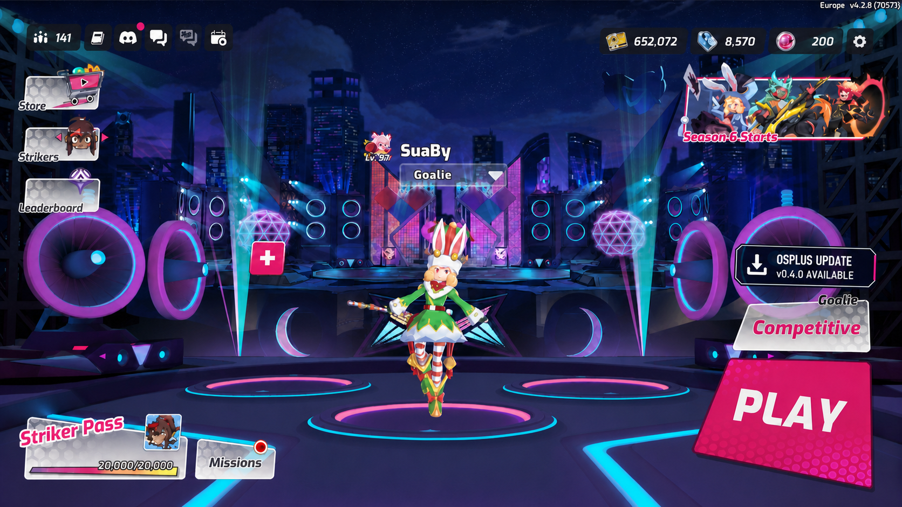
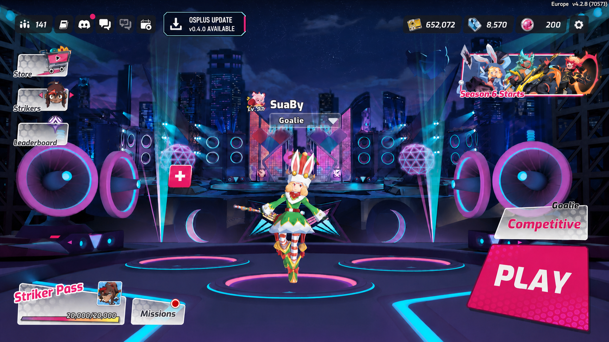

# Update availability notification

| Field | Value |
|---|---|
| Slug | `update-availability-notification` |
| Status | `building` |
| Created | 2026-07-26 |
| Last updated | 2026-09-05 |
| Owner | Codex + maintainer |
| Branch | `feat/update-availability-notification` |

---

## Brief

**Problem.** Players can keep using an outdated OSPlus build without any in-game indication that a newer stable release exists. Because release information currently lives outside the game, players who do not follow the project's external channels can miss fixes and features and unknowingly remain on an older build.

**Audience.** All OSPlus players, with particular value for the primary newcomer and mid-skill audience, returning players, and less-technical community members who should not need to monitor GitHub or community channels to learn that their mod is outdated.

**Wedge fit.** This is supporting distribution infrastructure rather than part of the profile + unlockables + events wedge itself. It keeps the installed OSPlus layer connected to that wedge by making players aware when fixes and new community-facing features are ready, reducing the chance that the active community fragments across old builds. Its scope must remain small enough that it supports rather than displaces delivery of the wedge.

**Anti-goal check.** The feature is an additive, visually quiet OSPlus surface; it does not replace native game UI, expose hidden gameplay information, or alter competitive decisions. It does not depend on Odyssey cooperation and introduces no monetization, cross-game, or age-inappropriate content. The notification must avoid live-play visual pollution, must not slow queueing or post-match flow, and must not become a compulsory update gate.

**Loose success criteria.**

- OSPlus evaluates update availability when the game starts, when the player successfully enters matchmaking, and when a match finishes.
- When a newer stable OSPlus release is available, the Home Hub shows a clear, non-blocking notice and plays one short, quiet sound. The notice uses a brief one-shot entrance animation to draw the eye, then stops moving rather than pulsing, shaking, or flashing continuously.
- Once presented, the notice remains still and visible for the rest of that Home Hub visit. It disappears when the player leaves the Home Hub; the same release does not animate, sound, or reappear again during that game session.
- Clicking the card optionally opens the GitHub release page for the displayed version in the default browser, without closing the game or installing anything.
- The notice remains readable across the Home Hub's changing backgrounds and does not cover its permanent navigation, account, event, player, mode, or Play controls.
- A notice discovered during active play waits for a safe out-of-match presentation point and never competes with gameplay, victory/defeat, rank, or reward feedback.
- The same release does not repeatedly replay its sound or flood the player with duplicate notices during one game session.
- An unavailable update service, a timeout, or malformed release information never blocks startup, matchmaking, post-match flow, or normal OSPlus use.
- A player already running the latest or a newer build sees no update notice.

**Out of scope.**

- Automatically downloading or installing the update.
- Closing or restarting the game on the player's behalf.
- Mandatory updates, forced confirmations, or minimum-supported-version enforcement.
- Pre-release channels, staged rollouts, or per-player release targeting.
- A full in-game release-notes browser.
- An in-game download action, update-progress screen, or update-completion report.
- User-configurable notification sounds, placement, animation style, duration, or frequency.
- Immediate real-time notification at the moment a release is published.

---

## Feasibility

**Verdict:** `Medium`

**Confidence rationale:** The network, file-IPC, match-end, cooked-widget, and
sound substrates are already present in shipping OSPlus code. The exact
queue-entry callback, Home Hub presentation gate, installed-version marker,
and new notification widget have not yet been exercised together in the live
game, so Stage 5 should validate a thin end-to-end slice before expanding it.

**Assumptions (named, not buried):**

- `dist/version.json` can be copied into every installed build and read by the
  sidecar as the installed public version. The build currently reads this file
  but does not put it in `OSPlus.zip`.
- A public `GET /updates/latest` route can live outside the authenticated
  profile API and expose a validated, cached projection of the latest stable
  GitHub Release without adding persistence or another service.
- The sidecar can derive HTTP/HTTPS from its configured relay URL and perform
  the update request without affecting its WebSocket connection. The existing
  profile client proves the HTTP substrate, but not this exact endpoint.
- `WBP_HomeHub_PC_C:OnMatchmakingStateChanged` reports a transition to
  `EMatchmakingStateV2.Queued` (`2`) once for each successful queue entry. The
  class, function, parameters, and enum value are present in the installed
  type stubs; the callback timing has not been observed live.
- A falling edge of `GameState_Game_C.CurrentMatchSeed` is a reliable online
  match-completion signal. This path is already production-proven by chat's
  match-end handling.
- A new `UserWidget` class, hard-referenced by `ModActor`, can be constructed,
  added to the viewport, and driven through `OSPlus_` Blueprint functions.
  The same integration pattern is proven for existing OSPlus widgets, but the
  notification's exact layout and animation are not yet cooked or live-tested.
- The active Home Hub can be distinguished safely enough to defer a pending
  notice until the player is out of active play. The class and navigation
  surface are known; the complete startup/queue/post-match visibility sequence
  still needs a live pass.

**Evidence trail:**

- `dist/version.json` is the public release source of truth, and release tags
  use `v<version>`, per
  [`github-release-distribution-contract`](../learnings/github-release-distribution-contract.md).
  `build_dist.ps1` currently reads the version only for its banner and omits
  the manifest from the archive, establishing the installed-marker gap.
- `sidecar/profile.js` already derives `http:` from `ws:` and `https:` from
  `wss:` and performs bounded JSON requests with Node built-ins. This proves
  that an update check does not require a new runtime dependency.
- `mod/OSPlus/scripts/ipc.lua` and `sidecar/index.js` already exchange flat
  JSONL messages in both directions. `update_check` and `update_available` fit
  this existing boundary without nested data.
- Startup ordering is suitable for a sidecar-owned first check:
  `main.lua` truncates the inbox, writes the first heartbeat, and only then
  launches the sidecar. The sidecar intentionally ignores old outbox content
  at launch, so the startup check must originate inside the new sidecar
  update client rather than from a pre-launch Lua message.
- Installed UE4SS type stubs expose
  `UPMMatchmakingUIData:HandleMatchmakingStatusChanged`,
  `UPMMatchmakingUIData:GetMatchmakingState`, and
  `WBP_HomeHub_PC_C:OnMatchmakingStateChanged(OldValue, NewValue)`;
  `EMatchmakingStateV2.Queued = 2`.
- [`chat-match-detection-via-seed`](../learnings/chat-match-detection-via-seed.md)
  records the production-proven `CurrentMatchSeed` match lifetime and the
  `OnRep_MatchState` plus periodic-fallback pattern.
- [`osplus-widget-integration-pattern`](../learnings/osplus-widget-integration-pattern.md)
  records the proven `ModActor` hard-reference, cooked `UserWidget`,
  `WidgetBlueprintLibrary.Create`, and `OSPlus_` function bridge.
- `chat.lua` already loads
  `/Game/Mods/OSPlus/UI/Sounds/SFX_OSPlus_UI_Click` and plays it once through
  `PlaySound2D`; player testing previously confirmed this short, quiet UI cue.

**Promoted findings (generally reusable, written to KNOWLEDGEBASE / learnings):**

- None. The reusable engine and integration facts are already covered by the
  linked learnings; the remaining gaps are specific to this feature's thin
  slice.

**Recommended Stage 5 path:** `thin slice first`

Build the local path first: an installed `0.3.0` marker, a local relay
declaring stable `0.4.0`, one sidecar comparison, one inbox event, and one
Home Hub presentation. Validate queue-entry timing, safe lobby gating,
animation, sound, and session deduplication live before treating the feature
as complete.

---

## Design

**Approach.** The relay exposes an unauthenticated
`GET /updates/latest` projection of the latest stable GitHub Release. The
sidecar reads the installed version marker, performs and coalesces bounded HTTP
checks, compares numeric semantic versions, and emits a flat
`update_available` IPC fact whenever an accepted lifecycle trigger knows about
a newer version. A dedicated Lua feature module owns the confirmed-queue check
and the decision to request a check from chat's already-established
match-ended edge, plus safe Home Hub presentation state; the sidecar owns the
startup trigger. Blueprint owns the compact notice above the
Competitive selector: it plays the existing quiet open sound and a single
short entrance animation, then remains still until the player leaves the Home
Hub.

**Axes considered:**

- Release source: chose GitHub Releases as authority with a cached relay
  projection over a separately edited relay version, because release state
  should not have two manual writers.
- Transport: chose HTTP as the durable source of truth over a WebSocket-only
  announcement, because clients can recover state after being offline; a
  future WebSocket event may only hint that the normal HTTP check should run.
- Installed-version source: chose a packaged `version.json` marker over a
  duplicated Lua or executable constant, because the release manifest already
  owns the public version.
- Check ownership: chose sidecar-owned HTTP, comparison, cooldown, and request
  coalescing over Lua networking, because UE4SS Lua has no network transport
  and the sidecar already owns HTTPS.
- Trigger semantics: chose startup plus confirmed queue entry plus match
  completion, with a five-minute successful-check cooldown, over fixed
  background polling or release-time push.
- Failure behavior: chose silent fail-open behavior over retries that can
  affect play; timeout, malformed data, or relay failure are logged. A warm,
  previously validated newer release may still be re-emitted, while a cold
  failure waits for the next eligible trigger.
- Cross-context state: chose relay cache to sidecar release state to Lua
  session presentation state to Blueprint display state, with one writer at
  each boundary and no mirrored canonical version state.
- UI placement: chose a compact card immediately above the Competitive
  selector over the larger centered card and compact top-bar card, because it
  stays close to the player's next action without crowding the permanent HUD.
- UI lifetime: chose one entrance animation and sound followed by a static
  notice for the current Home Hub visit; leaving the Home Hub dismisses that
  version for the rest of the game session.
- Update action: chose notification-only over an in-game download, forced
  confirmation, game closure, or automatic installation.

**Decisions deferred to ADR:** None. This is a feature-local extension of the
existing sidecar + relay HTTP topology. It introduces no database, new service,
new trust boundary, or persistent ephemeral state; GitHub Releases remains the
authority.

**Files that will change:**

- Relay route and cache module, relay tests, and relay deployment file lists.
- Sidecar update client, configuration resolution, IPC dispatch, and tests.
- `dist/version.json` packaging plus Windows and Linux installer placement.
- A dedicated Lua update-notification module, `ipc.lua`, and `main.lua`
  lifecycle wiring.
- The UE project's OSPlus update-notice widget and `ModActor` bridge, followed
  by a newly cooked and packaged `OSPlus.pak`.
- This feature brief, architecture references where the new contract belongs,
  and one learning entry after live validation.

**Existing boundaries that remain:**

- The native `WBP_HomeHub_PC_C`, Competitive selector, and Play button remain
  untouched; OSPlus adds its own cooked widget.
- GitHub Releases and `tools/release/publish_github_release.ps1` remain the
  release authority and publishing path.
- The existing WebSocket chat protocol and authenticated `/api/*` profile
  routes keep their current contracts.

---

## Extension: clickable release page (2026-09-05)

**Accepted behavior.** Clicking anywhere on the existing card opens the GitHub
release page for the version displayed in the player's default browser. A
restrained hover highlight, hand cursor, and localized inline hint on the
card's secondary line make the action discoverable. This is an optional page
visit; it does not install anything or close the game. The existing Home Hub
lifetime, transition layering, entrance
cue, dimensions, and text overflow rules still apply.

**Feasibility.** The UE 5.1 source and installed game object dump expose
`UKismetSystemLibrary::LaunchURL(const FString& URL)` as a Blueprint-callable
function. Windows delegates HTTPS links to the default browser. OSPlus already
receives `releaseUrl` in the existing update fact, so no new relay route or
sidecar message is required. The API has no return value; opening the browser
must be checked live rather than inferred from the function call alone.

**Ownership.** Lua validates the exact HTTPS `LuizinhoF/osplus` GitHub release
tag against the displayed strict stable version, retains the visible release
fact for restoration, and pushes `OSPlus_SetReleaseLink(url, tooltipString)`.
The parameter name remains for compatibility; its text is now an inline hover
hint. Blueprint owns the active click target, hover/pressed appearance, hint, and
`OnClicked -> OSPlus_OpenReleasePage -> LaunchURL` interaction. Pending release
facts cannot retarget a card that still displays an earlier version. Missing,
invalid, or mismatched addresses clear and disable the button while leaving the
informational card visible.

**Input.** A transparent button fills only the 300x64 animated card. The outer
UserWidget and full-screen root use `SelfHitTestInvisible`, so surrounding Home
Hub controls remain usable. A `HitTestInvisible` ancestor would block the button
along with the rest of its descendants. The button starts disabled until Lua
sets a validated destination. All string-to-text conversion stays in Blueprint,
including the hint, using the existing localization bridge convention.
The existing native `OdyUIRouter:OnMenuDisplayStateChanged` hook filters
`WBP_SettingsHub_C` to own the Settings input cover: numeric nonzero states
cover, `NotShowing` (`0`) clears, and unreadable state preserves the gate.
Chat registered the short navigation event names first, so the update module
cannot use a second `RegisterCustomEvent` subscriber on UE4SS 3.0.1. Settings
router state and native loading events clear the applied link and hint and disable
descendant hit testing while those overlays cover the Home Hub. Returning
restores the saved displayed release without ending the visit or replaying the
cue.

**Hover revision.** The initial standard Slate tooltip remained visible above
other windows when the game was minimized while the notice was hovered; the
player confirmed it cleared only after hovering again. The revised widget
leaves its native tooltip empty and swaps the secondary version line for a
localized inline hint. Both lines share `VersionDisplay`; hiding the version
with `Hidden` preserves its layout contribution. Unhover and link refresh reset
the line. The localization key remains `update_notification.view_release`.

**Alternatives.** A fixed latest-release link could disagree with the displayed
version; opening the validated exact tag avoids that ambiguity. A separate
small icon would be a harder target than the existing card. A sidecar browser
launcher or Lua mouse hook would duplicate behavior already supported by UMG
and the engine.

**Verification.** The earlier 31 mocked scenarios passed before the
first-registration-wins custom-event limitation was modeled. The corrected
mock now passes 27 scenarios covering the Settings router, wrapped arguments,
transition states, overlapping covers, language/pending facts, and Home Hub
exit; Lua syntax passes.
The initial clickable widget compiled and saved on two consecutive authoring
passes; safe graph/tree inspection confirmed one full-card button and one bound
click event, with the release-link setter and guarded browser launch connected.
Live English and Portuguese clicks opened the exact simulated
`https://github.com/LuizinhoF/osplus/releases/tag/v0.4.0` address while the game
stayed running. Its browser 404 was expected for the unpublished simulation.
That run also exposed the stranded-tooltip defect. The inline-hint replacement
now has live English/Portuguese normal and hover captures with contained text,
an exact-tag browser launch, successful browser focus loss/return, and no
floating text on the Settings screen. The final Settings router gate also
passed live in a Steam-launched game: its cover-state log changed on opening
and closing Settings, clicking the covered card's position opened nothing,
and clicking after returning to Home Hub opened the exact `v0.4.0` tag while
the game stayed responsive. Exact minimizing while hovered remains unverified.

---

## Investigation: loading-screen leak and visual mismatch

### Prior art

- [`osplus-widget-integration-pattern`](../learnings/osplus-widget-integration-pattern.md)
  establishes that ModActor-created widgets persist under the GameInstance.
- [`chat-settings-lifecycle-suppression`](../learnings/chat-settings-lifecycle-suppression.md)
  establishes that additive UI needs native lifecycle state rather than a
  viewport-order guess.
- No prior learning covered moving a persistent ModActor-created widget into
  the Home Hub's own visual hierarchy.

### Reproduction

The first cooked 304x90 notice played its sound and rendered during startup
loading. `%LOCALAPPDATA%/OSPlus/test_events.log` recorded:

1. `Map loaded`
2. `Home Hub active (presence probe)`
3. `Notification shown for 0.4.0`

There was no preceding Home Hub `OnNavigatedTo` event. The supplied live
screenshot also showed that the large rectangular download card was nearly as
strong as the native mode selector and did not share its compact, italic,
layered alert language.

### Hypotheses and results

- **Confirmed:** `FindFirstOf("WBP_HomeHub_PC_C")` detects a constructed
  persistent object, not the screen the player is currently seeing.
- **Confirmed:** viewport z-order `20` let the early card appear above the
  native loading layer.
- **Confirmed live:** `WBP_HomeHub_PC_C.UIContainer` is the direct canvas
  parent of `PlayPanel`. The Play panel uses z-order `2`; native group invites
  and modal layers are higher.
- **Confirmed visually:** the large Unicode download symbol, divider, full
  cyan outline, upright type, and 304x90 rectangle made the card read like a
  developer overlay rather than a Home Hub notification.
- **Falsified after a native crash:** polling
  `Router_OutOfGame_C:GetTopOfStack(...)` plus the loading widget every second
  looked like a stronger gate, but a destroyed router result left a stale Lua
  UObject wrapper. Filtering it with `GetClass()` crashed at
  `UE4SS.dll+0x229E17`, symbolized to
  `RC::LuaType::construct_uclass` dereferencing a null remote pointer.
  `pcall` cannot catch that C++ access violation.

### Fix

- Home Hub navigation and router display-state events now own visit lifetime.
  `AnimatingIn` prepares the notice and `Showing` permits its one-shot
  presentation.
- While still collapsed, the notice is removed from the global viewport and
  added to `WBP_HomeHub_PC_C.UIContainer` in a full-stretch canvas slot at
  z-order `2`, beside the native `PlayPanel`. Its full-screen wrapper passes
  clicks through while the bounded card accepts clicks, and
  native loading, party, and modal layers remain above it. The loading
  transition therefore covers and reveals it naturally.
- Map load reads the Home Hub's own `DisplayState` once to cover an event
  missed during startup. There is no visual settle timer or repeated router
  lookup.
- Visibility and cue timing are separate. The card is made visible behind the
  native loading layer, while the stable
  `OdyWidget:AnimateOutComplete` callback, filtered to
  `WBP_LoadingScreen_C`, releases its one-shot animation and sound only after
  the loading widget has hidden. A one-time `DisplayState` read plus
  construction-state recovery covers already-completed loading and late widget
  creation without a guessed delay.
- Callback class filters use UE4SS's null-guarded `GetFullName()` bridge
  instead of the unsafe `GetClass()` bridge.
- Match completion reuses chat's already-proven match-ended edge rather than
  adding a second reflected polling loop. Async IPC queues at most one bounded
  game-thread presentation attempt when the event-owned gates are open.
- The card is restyled to 300x64 and aligned above the mode selector. It uses
  a small alert diamond, compact italic title, softer cyan edge, navy depth,
  and restrained pink tab; the download glyph and divider are removed. Its
  15-point title and version are constrained to one line, with ellipsis and
  hard clipping as a fallback for translations longer than the available
  width.
- Its title and version line come from
  `data/localization/screens/update_notification.json`. Lua resolves the
  current locale and passes ordinary strings through the cooked
  `OSPlus_SetLocalizedText` bridge, matching the emote screen's proven
  workaround for unsafe direct `FText` marshaling. A failed text bridge leaves
  the release pending and the card collapsed instead of exposing the authored
  English fallback.

### Verification

- The crash minidump was parsed and symbolized with the exact upstream PDB;
  the recovered UE4SS DLL and installed DLL have identical SHA-256 hashes.
- A mocked event-lifecycle pass covers loading deferral, navigation lifetime,
  queue and match triggers, map resets, one-session deduplication,
  game-thread-only widget calls, and poison stale wrappers. It asserts there
  is no loading-manager lookup, `GetClass()` call, visual settle timer, or
  repeated router confirmation.
- The revised widget and ModActor both compile and save in the UE 5.1 editor.
- In the live Steam-started build, all three localization files loaded, the
  game-selected locale was `pt-BR`, and the notice was populated and shown for
  simulated release 0.4.0 with that locale. After correcting the localized
  title overflow, a new 1920x1080 Home Hub capture confirms
  `ATUALIZAÇÃO OSPLUS` and `v0.4.0 disponível` remain fully inside the 300x64
  card above Competitive. Switching the game language to English at runtime
  emitted a locale-change event, refreshed the visible card without a restart,
  and left both the Portuguese and English layouts contained.
- The same run attached the card during router `AnimatingIn`, presented it only
  after Home Hub `Showing`, and released its one-shot cue only after the native
  loading layer was confirmed absent. The game remained responsive and no new
  crash report appeared.
- Lua parsing, all 13 sidecar tests, and all 13 relay tests pass. Source,
  installed files, and the rebuilt distribution archive have identical
  SHA-256 hashes for the notice Lua, localization JSON, and cooked pak.

The corrected lifecycle and crash rules are recorded in
[`home-hub-visibility-requires-router-and-loading-state`](../learnings/home-hub-visibility-requires-router-and-loading-state.md)
and
[`ue4ss-stale-uobject-getclass-crash`](../learnings/ue4ss-stale-uobject-getclass-crash.md).

---

## Outcome

Accepted for v0.4.1 after maintainer review of the Home Hub notification,
localization, layout, sound, and release-page click behavior. Implementation
commit: `09bd218`.

The release also includes the separately investigated pregame chat-presence
privacy fix. Its automated checks pass; the maintainer explicitly deferred
the in-game phase test. See [patch notes](../releases/0.4.1-patch-notes.md) and
[the chat investigation](../learnings/chat-pregame-presence-privacy.md).

---

## Notes

### Framing decisions already accepted

- Update availability is informational and non-blocking.
- The three required evaluation moments are game startup, confirmed matchmaking entry, and match completion.
- The Home Hub is the primary presentation surface. The notice uses one quiet sound and a short, non-looping attention animation while remaining legible over changing menu backgrounds.
- After its entrance animation, the notice remains still and visible until the player leaves the Home Hub. Leaving dismisses it for that game session; returning does not replay the same release's sound or animation.
- The original mandatory confirmation, game closure, and self-update concept is superseded by this notification-only feature.

### Prior transport recommendation to validate in Stage 3

The maintainer prefers an HTTP release-state check for the first version, with any future WebSocket message acting only as a hint to repeat that check. Prior investigation also recommends comparing the installed public version locally against a shared latest stable release, keeping GitHub Releases authoritative, and exposing a cached relay projection rather than a separately edited relay version. Stage 3 must formalize the evidence and assumptions for that direction before Design treats it as locked.

### Home Hub placement decision

The selected placement is the compact two-line card immediately above the
Competitive selector. The live-tested first pass was too large and read like a
desktop download control, so the revised card is 300x64 with a small alert
diamond, 15-point italic title, softened cyan edge, navy depth, and restrained
pink tab. The width follows the selector below and contains the full Portuguese
title. Explicit one-line overflow and clipping rules prevent longer future
translations from crossing the card boundary. This treats the notice as a
lightweight Home Hub alert attached to the mode and Play stack while avoiding
density in the permanent top HUD.

The top-bar compact alternative was rejected because it competes with
navigation and account information and is less connected to the player's next
action. The selected placement still needs live validation with party members,
queue overlays, bright seasonal backgrounds, minimum supported resolution,
and ultrawide scaling.

### Revised concept mockups

**Above Competitive (recommended):**

**Top-bar compact:**

These generated images establish the notification card and its relationship to
the Home Hub only. Their surrounding Home Hub is a generative restaging of the
supplied screenshot, not a pixel-accurate reconstruction.

### Prior read-only investigation to carry into Stage 3

The preliminary investigation is now formalized above. Queue-entry detection,
safe presentation timing, and the exact installed-version comparison remain
the thin slice's live validation targets.
