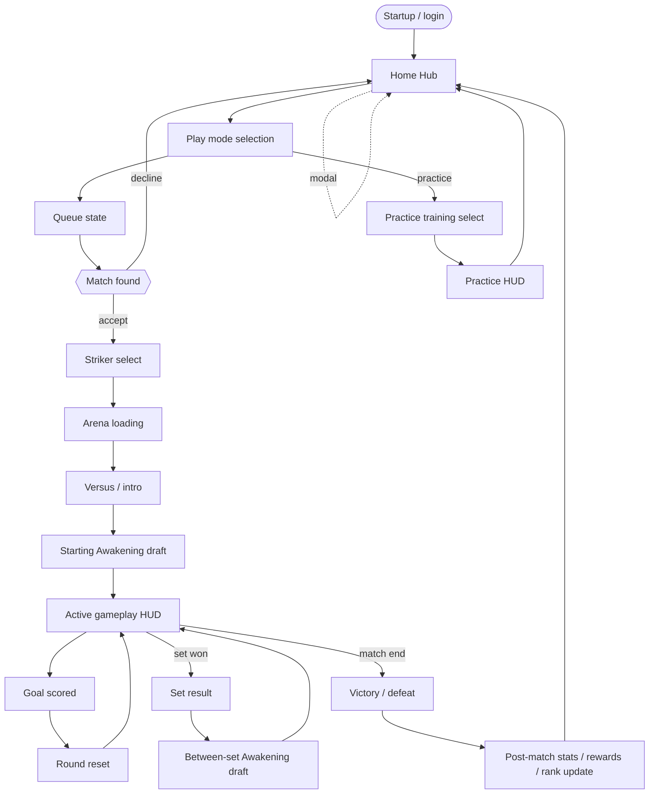

# OS screens — player-side map

Inventory of every screen, modal, and overlay the player navigates
between in Omega Strikers. Cross-referenced to engine widget classes
where known via [`docs/glossary.md`](../glossary.md) and
[`KNOWLEDGEBASE.md`](../../KNOWLEDGEBASE.md). The vocabulary every
other game-doc and feature uses.

NOT engine internals (those live in
[`KNOWLEDGEBASE.md`](../../KNOWLEDGEBASE.md) and the planned
[`docs/engine/`](../engine/) subtree).
NOT OSPlus surfaces (those live in [`docs/architecture/`](../architecture/)).

> **Status:** seeded 2026-04-29 from
> [`OMEGA_STRIKERS_GAME.md`](./OMEGA_STRIKERS_GAME.md) Sec 25 +
> `KNOWLEDGEBASE.md` widget hierarchy. Most screens have known
> engine-internal names; per-screen detail is partial. Sections marked
> *TBD* are pending observation or interview.

## At a glance

The fast-lookup table. Top-level screens (replace the whole view) +
modals (open *over* a screen). Engine-internal class is the live
runtime form (with `_C` suffix).

### Top-level screens

| Screen | Phase | Purpose (1 line) | Engine class |
|---|---|---|---|
| Startup / login | Pre-session | Game launch, auth handshake, EULA check | TBD |
| **Home Hub** (main lobby) | Out-of-game | Default screen between matches; queue, party, customize, social | `WBP_HomeHub_PC_C` |
| **Customization (Striker)** | Out-of-game | Per-Striker customization page; tabs for Affinity / Overview / Cosmetics, with Cosmetics holding sub-tabs for Skins / Emote / Goal Explosion | `WBP_Menu_Striker_C` (page) + `WBP_Panel_StrikerCosmetics_C` (Cosmetics tab body) + `CosmeticsPanelSwitcher` (sub-tab `UWidgetSwitcher`); see [`docs/engine/widgets.md` → "Customization screen"](../engine/widgets.md#customization-screen-home-hub--customize) |
| Play mode selection | Out-of-game | Pick which mode to queue (Ranked, Brawl, Practice, Custom — see [Modes](#modes)) | TBD |
| Queue state | Out-of-game | "Searching for match" overlay/state | TBD |
| Match found notification | Out-of-game | "Accept / decline" prompt when matchmaker locks a match | TBD |
| Striker select / draft | Pre-match | Pick Striker, gear, cosmetics; see opponents' picks | `WBP_StrikerSelect_ChoosePhases_C` (practice), `WBP_CharacterSelectModal_C` (live) |
| Arena loading | Pre-match | Map load + asset stream | TBD |
| Versus / intro | Pre-match | Brief team preview shown before play starts (see [B7 below](#open-questions)) | TBD |
| Starting Awakening draft | In-match | Pick first Awakening at match start | TBD (likely `WBP_*Awakening*` family) |
| Active gameplay HUD | In-match | The match itself — ability cooldowns, score, barriers, all in-match info | See [in-match-hud.md](./in-match-hud.md) |
| Goal scored | In-match | Brief celebration / acknowledgment after a goal | TBD |
| Round reset | In-match | Between rounds within a set | TBD |
| Set result | In-match | "X team wins set N" between sets | TBD |
| Between-set Awakening draft | In-match | Pick additional Awakening between sets | TBD (likely same widget family as starting draft) |
| Victory / defeat | Post-match | Win/loss announcement | TBD |
| Post-match stats | Post-match | Per-player performance summary, rewards earned | TBD |
| Rewards / progression | Post-match | XP gained, level-ups, mission progress | TBD |
| Rank update | Post-match | Rank change visualization (Ranked mode only) | TBD |
| Settings | Anywhere | Audio, video, controls, account, mod settings | `WBP_SettingsHub_C` (`MainScrollBox` confirmed) |
| Error / reconnect / maintenance | Anywhere | Connection lost, server maintenance, version mismatch | TBD |

### Practice mode flow (separate from above)

Practice has its own dedicated map (`GameMapPractice`) and
GameState (`GameState_Tutorial_C`). Some shared screens (Striker
select, settings) work the same; others (Awakening draft,
victory/defeat, rank update) don't apply.

| Screen | Practice-specific notes |
|---|---|
| Training select | Modal that picks practice scenario | `WBP_TrainingSelectModal_C` |
| In-match HUD | Same shape as live HUD but no opponents, no match seed, no rank stake | See [in-match-hud.md](./in-match-hud.md) |
| Ability tooltips | Modal explaining current Striker's abilities in practice | `WBP_InGameMobile_AbilityTooltipsModal_C` |

### Modals / overlays

Open *over* a top-level screen rather than replacing it. Most live
under `GameInstance_Base_C` and persist across map loads.

| Modal | Trigger | Appears over | Engine class |
|---|---|---|---|
| Friend chat (DM) | Click friend in social panel | Lobby, post-match | `WBP_FriendChatModal_C` (`MessagesScrollBox`) |
| Friend chat — start | "+ new chat" action | Lobby | `WBP_FriendChat_StartChatModal_C` |
| Social / friends | Social button | Lobby | `WBP_SocialModal_C` (`ScrollBox_0`, `ContentScrollBox`) |
| Group invite panel | Receive party invite | Lobby | `WBP_GroupInvitePanel_C` (`InviteListContainer`) |
| Store | Store button | Lobby | `WBP_Store_C` (`Tabs_ScrollBox`, `ScrollBox_Description`, `ScrollBox_0`) |
| Character lore | Click "lore" on a Striker | Striker roster | `WBP_CharacterLoreModal_C` (`MainScroll_1`) |
| Daily login reward | First lobby load each day | Lobby | `WBP_Menu_DailyLogin_C` (`ScrollBox_58`) |
| Tournament announcement | Active tournament window | Lobby | `WBP_TournamentAnnouncement_C` |
| Visual novel scene | Story / character intro events | Various | `WBP_VisualNovelTextMessageScene_C` (`MessageScrollBox`) |
| Report player | "Report" action on a player | Anywhere they're visible | `WBP_ReportPlayerModal_C` (`ScrollBox_0`) |
| Settings hub | Settings keybind / button | Anywhere | `WBP_SettingsHub_C` |
| Reaction wheel | `1`-`7` hotkeys (in-match) | Active gameplay HUD | `WBP_ReactionModal_C` / `WBP_ReactionButtonPanel_C` (see [glossary → Emote / Emoticon](../glossary.md#emote--emoticon)) |
| Profile view (own) | TBD — likely a profile/account button | Lobby | TBD |
| Profile view (other player) | TBD — likely click on a player nameplate | Anywhere they're visible | TBD |

The native game's chat box (DM-style) lives in
`WBP_FriendChatModal_C`; OSPlus's mod chat (`WBP_ModChat_C`) is a
separate widget that lives next to it under `GameInstance_Base_C`,
not part of native chat — see
[`docs/architecture/state-contract.md`](../architecture/state-contract.md).

## Per-screen detail

The screens that have observed detail. Order: out-of-game → pre-match →
in-match → post-match. Use [the template](#per-screen-template) when
adding a new screen.

### Home Hub (main lobby)

- **Purpose.** Default screen the player returns to between matches.
  All non-match flows originate here.
- **How you arrive.** First non-tutorial screen after startup;
  return-to-lobby button from post-match.
- **How you leave.** Click Play (→ play mode selection) / open a
  modal (store, social, settings, daily login) / queue accept (→
  Striker select).
- **What's on screen.** Centered: equipped Striker preview (3D
  model). Surrounding nameplates: party members + self
  (`PlayerNameplateCenter` + `GroupMemberNameplateLeft/Right`). Top
  bar: account info (rank, XP, currency). Bottom: queue / party
  controls. Side panels: store, social, missions buttons. Background:
  current event/season art.
- **Modals or overlays that can appear here.** Daily login (first
  load each day), tournament announcement, social, store, group
  invite, settings, group invite panel.
- **Match / network state at this point.** No match active.
  `GameState_Game_C` does NOT exist; `GameStateBase` is the engine
  base class. `PlayerController_Menu_C` is the active controller. No
  Pawn. `PMIdentitySubsystem` reachable for SteamID + Prometheus ID.
- **Engine-internal name.** `WBP_HomeHub_PC_C` (lives under
  `GameInstance_Base_C`; persists across map loads).
- **OSPlus relevance.** OSPlus chat (`WBP_ModChat_C`) and mod widgets
  attach here. The `unlockable-earning-emotes` feature targets this
  surface for the loadout-customize flow + the in-match wheel.
- **Notes.** Children of `WBP_HomeHub_PC_C` per F3 dump:
  `WBP_FitActorToRect_C` (the 3D character model),
  `WBP_ReactionButtonPanel_C` (emote/reaction loadout),
  `WBP_PlayPanel_C` (queue button), `WBP_GroupInvitePanel_C` (party
  invite list), `WBP_GameVersion_C`, `WBP_TournamentAnnouncement_C`.

### Striker select / draft

- **Purpose.** Pick the Striker, gear, and cosmetics for the match.
- **How you arrive.** Match accepted from queue; map loads under it.
- **How you leave.** Lock-in confirms picks → arena loading; timer
  forces a default pick; team-mate ready state may matter.
- **What's on screen.** Roster (available Strikers); selected
  Striker preview; team panel (your picks visible to teammates,
  opponent picks visible to you per game mode); gear loadout; ban /
  pick state if applicable; timer.
- **Modals or overlays that can appear here.** Settings; possibly
  report-player; possibly DM modal.
- **Match / network state at this point.** Online: `GameState_Game_C`
  exists; `PlayerController_Game_C` active; `PlayerState_Game_C`
  exists; **`PlayerController.Pawn` is nil** — the player has no
  combat actor yet. Practice: `WBP_StrikerSelect_ChoosePhases_C` is
  the screen widget directly; live online uses
  `WBP_CharacterSelectModal_C:ChoosePhase` over a different shell.
- **Engine-internal name.** `WBP_StrikerSelect_ChoosePhases_C`
  (practice / scoped use); `WBP_CharacterSelectModal_C` (online live
  match).
- **OSPlus relevance.** Chat is gated off here per
  [`chat-match-detection-via-seed`](../learnings/chat-match-detection-via-seed.md)
  — match seed isn't set until gameplay starts.
- **Notes.** Per `WBP_CharacterSelectPlayerCard_C.PlayerName_Text`,
  display name is rendered in the per-player card (rich-text block).

### Active gameplay HUD

See dedicated [`in-match-hud.md`](./in-match-hud.md). Distinct file
because the HUD is the densest player-attention surface in the game
and warrants its own per-element breakdown.

### Settings

- **Purpose.** Audio, video, controls, account, accessibility.
- **How you arrive.** Settings keybind / button (anywhere).
- **How you leave.** Close button / back navigation; preserves screen
  underneath.
- **What's on screen.** Tabbed panels: Audio, Video, Game, Controls,
  Account, etc. (TBD: full tab inventory.) `MainScrollBox` is the
  long scroll area within each tab.
- **Modals or overlays that can appear here.** Confirmation prompts
  for destructive actions (e.g. unlink Steam).
- **Match / network state at this point.** Any. Settings is a
  GameInstance-persistent modal; works in lobby, in-match,
  post-match.
- **Engine-internal name.** `WBP_SettingsHub_C` (always loaded — F9
  dump shows it persistent across all phases).
- **OSPlus relevance.** Future OSPlus settings tab would attach here;
  no current attachment.

### Practice — Training select

- **Purpose.** Pick which practice scenario to load (free play,
  abilities, drills, etc. — TBD complete list).
- **How you arrive.** Enter practice mode from main menu / play mode
  selection.
- **How you leave.** Confirm scenario → arena loading
  (`GameMapPractice`).
- **Engine-internal name.** `WBP_TrainingSelectModal_C`
  (`ScrollBox_0`).
- **Notes.** `PlayerNamePrivate` returns the hex Prometheus ID
  instead of display name in practice mode — see
  [`playernameprivate-transient-account-id.md`](../learnings/playernameprivate-transient-account-id.md).

## Modes

Section 3 of [`OMEGA_STRIKERS_GAME.md`](./OMEGA_STRIKERS_GAME.md)
references "Choose mode" but never enumerates available modes. Per
KNOWLEDGEBASE + Clarion API observation, the modes axis exists in
backend stats (`character × role × gamemode`) but the player-facing
list of modes has not been documented. **TBD interview** — at minimum:

- **Ranked.** Competitive matchmade play with rank stake. Probably 3v3.
- **Brawl / Casual / Unranked.** Lower-stakes matchmade play. TBD whether this is one mode or multiple.
- **Practice.** Solo training; uses `GameMapPractice` and `GameState_Tutorial_C`.
- **Custom lobby.** Private match with manually-invited players. TBD whether this uses `GameState_Game_C` or a different class.
- **Co-op vs AI / Tutorial / Story.** Existence and shape TBD.
- **Tournament / event modes.** Per `WBP_TournamentAnnouncement_C` existing in the home hub, occasional event modes appear; cadence TBD.

The mode the player picked affects: which screens they see (some screens
are mode-specific — e.g. rank update only in Ranked); which Awakenings
are available; which maps are eligible; which stats persist to the
backend.

## Navigation graph



Edges marked with intermediate states (e.g. "set won") happen
in-match without a screen change — they're state transitions on the
HUD, not navigation between screens.

## Open questions

Items deliberately left unresolved during this migration. Pick one
off and answer it via interview, observation, or Stage-3 probe; then
fold the answer into the relevant per-screen detail.

- **B7 — Versus / intro screen.** What is it exactly? Brief team
  preview before play? Cinematic? Does it actually appear in current
  builds, or was it dropped?
- **B8 — Modes enumeration.** Definitive player-facing list of modes
  available in current builds. See [Modes](#modes).
- **C5 — Profile-view UI.** Does the native game have a profile-view
  screen? Where does the planned OSPlus
  *In-game profile visible surface* feature attach? Modal over hub?
  New top-level screen?
- **C6 — Rank update vs progression.** Are these two separate
  post-match screens or one combined screen with multiple panels?
- **A3 (partial) — Custom lobby flow.** What screens does the custom
  lobby flow involve? Lobby creation, settings, invite, ready, start?
- **Goal scored / round reset / set result.** What do these actually
  look like? Are they full-screen overlays, HUD-corner banners, brief
  freeze-frames? Per-screen detail TBD.
- **Match found notification.** Is there an accept / decline prompt
  with timer? Or auto-accept once queued?
- **Practice training scenario list.** What scenarios are available?
- **Settings tab inventory.** Full list of tabs + what each contains.

## Conventions

### Per-screen template

Copy this when documenting a new screen:

```markdown
### `<Screen name>`

- **Purpose.** (one sentence — what is the player doing here)
- **How you arrive.** (from where + what action triggers the transition)
- **How you leave.** (to where + what action triggers each exit)
- **What's on screen.** (high-level — just enough that someone designing a new
  surface knows what's competing for the player's attention. Not pixel-perfect.)
- **Modals or overlays that can appear here.** (cross-link to *Modals* above)
- **Match / network state at this point.** (e.g. "no match active, idle on
  home server" vs. "between rounds, GameState replicating" vs. "post-match,
  returning to lobby")
- **Engine-internal name.** `WBP_...` (fill when known; `TBD` if unknown)
- **OSPlus relevance.** (anything OSPlus already does or plans to do here, with cross-links)
- **Notes.** (anything else worth capturing — patches that have changed it, quirks, etc.)
```

### Naming

- Screen names use the player-facing label when one exists (e.g.
  *"Home Hub"*, *"Striker select"*) — not the engine name.
- Engine names appear in the *Engine-internal name* field, with
  backticks. Use the runtime form (`_C` suffix).
- If multiple screens share an engine class (e.g. one widget reused
  in multiple contexts), say so explicitly.

### Cross-references

- To engine internals: link via [`docs/glossary.md`](../glossary.md)
  when an entry exists; otherwise link to the relevant
  `KNOWLEDGEBASE.md` section.
- To OSPlus features: link to `docs/features/<slug>.md` (the feature
  paper trail), not to a script file.
- To learnings: link when a documented gotcha applies (e.g. *"see
  [`chat-match-detection-via-seed`](../learnings/chat-match-detection-via-seed.md)
  for why the chat is gated off here"*).

### Acceptable incompleteness

This doc is allowed to be partial. What is **not** acceptable:
silently listing a screen with no per-screen detail, no engine
class, and no `TBD` marker. Either fill it in, or mark pending —
never both blank.
